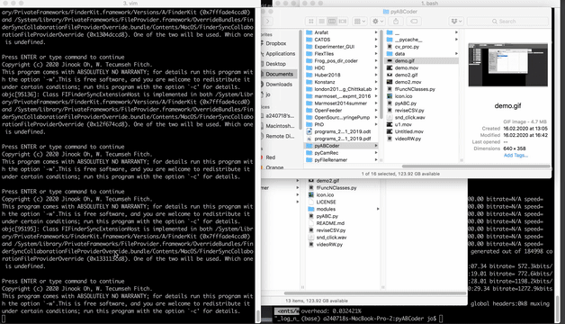

# pyABC

This is a branch from HDC (Head direction coder) for experiments to investigate animal cognition.

Jinook Oh, Cognitive Biology department, University of Vienna 
Contact: jinook0707@gmail.com, tecumseh.fitch@univie.ac.at 
February 2020.

## Dependency:
- **wxPython** (4.0)
- **numPy** (1.17)
- **OpenCV** (4.1)

## What it does.
The first process is done by **pyABC.py**, it is an automated tracking of an animal or certain part of animal in a specific experimental setup, using a combination of computer vision algorithms.
It produces a CSV (comma separated values) text file as an initial result

The tracking algorithms is a cascade of finding certain visual features. For example, head direction of macaque monkey is determined with following steps.
1) Find bluish color (wooden panel in the experimental setup)
2) In the bluish area found in 1), find a color of macaque monkey's head. Then, determine a square area around the center of the found color.
3) In the square area found in 2), find a color of macaque monkey's face.
4) Draw (head direction) line from the center of area, found in 2), to the center of area, found in 3).

This kind of algorithm could be errenous depending on lighting condition, animal's posture, experimenter's interference and so on.
Therefore, certain level of errors are expected.
Then, the second process should be conducted via **reviseCSV.py**, to correct such errors.

## How to use.

### *pyABC.py*
1) Click **Analyze video** button, then choose MP4, MOV or AVI video file.
2) Set proper parameters on the left side. Each parameter has [?] button to explain what it is.
3) Press **Spacebar** key to start/stop automatic analysis.
---
* On the right side (data grid), a user can directly enter manual data in each cell.
* When manual data is entered, a user can choose multiple cells, then change those cells' data altogether.
* A user also can enter a manual data by click-and-drag mouse pointer on the video frame image directly.
* If **Continuous manual input** is checked, the data of previous frame will be copied to the current frame.

### *reviseCSV.py*
1) Choose a CSV file (result from pyABC.py) to open
2) Click **Smooth** button to smooth data. (Averaging data in sliding window (+/- 5 frames by default))
3) When errenous frames are noticed, click **SelectionMode** button or press Shift + S. > Click the beginning of selection, then click the end frame of selection. > Enter data and click **Set** button, or click **Linear interpolation** button.
4) Click **Save CSV** button to save revised CSV data.
5) Click **Save video** button to save video user sees on the program UI (as a visualisation of the revised CSV data).
---
* Left mouse click on graph will make the video jump to the clicked frame. (Also, a user can enter specific frame index and click **go** button.)
* Right mouse click on graph will add a small marker on graph. Functionality of this marker is only to notify certain frame for user in short term. For example, to mark the beginning frame of erreneous result to apply adjustments after the errenous result. User can clear all markers by clicking **Clear markers** button.

### Remarks
1) To start mamoset video (also macaque) analysis, a user can simply start running it with spacebar key. (No need to give any initial input)
2) For rat video analysis, a user should click-and-drag for giving an initial head direction on the first frame image. Then, continuous analysis can be conducted on all the consecutive frame images by pressing spacebar key.

## How to add new experiment analysis

### in *pyABC.py*
1) Add case string: changing variable **self.animalECaseChoices** in **\_\_init\_\_** function.
2) Add new items in variables, **self.dataCols**, **self.dataInitVal**, **self.dataStruct**, etc in **setDataCols** function.
3) Set variables properly (according to a specific algorithm to apply in **cv_proc.py**) in **setAECaseParam** function.

### in *cv_proc.py*
1) Add a line to call a case specific function in **proc_img** function.
  e.g.) elif animalECase == 'Macaque19': x, frame_arr, diff = self.proc_macaque19(x, frame_arr)
2) Add a function to calculate data for automatic tracking, such as **proc_macaque19**.

